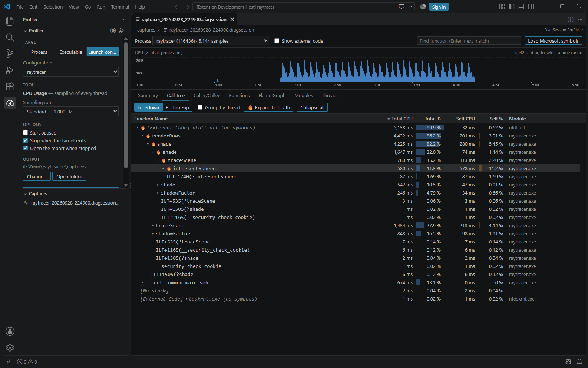

# DiagSession Profiler

A VS Code extension to profile native code, based on the `VSDiagnostics.exe` Visual Studio tool. It records CPU
captures (`.diagsession`) and opens them, as well as raw ETW traces (`.etl`), with these views:



| View | What it shows |
|---|---|
| **CPU graph** (always on top) | CPU usage of the process over time, as % of all processors. Drag to select a time range: every view then analyses only that range. Double-click to clear. |
| **Summary** | Process, analysed range, CPU time, average cores, symbol coverage, the **hot path**, top functions by self and by total time. |
| **Call Tree** | Top-down tree with Total / Self CPU (ms and %), the 🔥 hot path expanded, *Bottom-up* (inverted) mode, *Group by thread*, find (Enter = next match). |
| **Caller/Callee** | Butterfly view of one function: who calls it, and what it calls. Click ⇄ to make a caller/callee the current function, ← Back to return. |
| **Functions** | Every sampled function, with self and total time, sortable and filterable. |
| **Flame Graph** | Icicle (VS style) or classic flame. Click to zoom, Ctrl+wheel to magnify around the cursor, drag (or Shift+wheel) to pan, double-click for source, search to highlight (shows the matched share). |
| **Timeline** | The function calls of each thread over time (a flame chart per thread): the main thread first, then the threads that did the most work. Click a thread to expand or collapse it, Ctrl+wheel to zoom, drag to pan, search to highlight. A call goes on across a short pause of its thread (preempted, waiting: 50 ms by default, *Join calls across pauses up to*), and across samples whose stack walk failed; the strip under the thread name shows when it ran. Right-click a call to zoom to it or analyse only that call in every view. |
| **Modules** | Time per binary, symbol status and path. |
| **Threads** | CPU per thread with its start function. Tick threads to filter every view. |

Double-clicking a function (or *View source* in the right-click menu) opens its source file in an editor split
below the report, reused for every file opened from it (`diagsession.sourceEditorLocation`: `below`, `beside`
or `active`). Each sampled line gets its **total** and **self** CPU, as a heat background and inline text.
*DiagSession: Clear Profiler Source Annotations* removes the annotations.

Right-click a table header to choose its columns (*Total samples*, *Self samples* and *Source File* are hidden
by default). The choice is remembered per view.

**Show external code** (`diagsession.showExternalCode`, off by default; the checkbox saves the setting and every open
report follows it) off works like VS's *Just My Code*: runs of Windows frames, symbol-less frames (with
`diagsession.localSymbolsOnly`, frames of modules whose PDB is not next to them) and functions of
the C++ namespaces listed in `diagsession.externalNamespaces` (default `std` and `stdext`; `std` also covers the
STL's `__std_*` helpers) collapse into one `[External Code]` frame. That frame is
named after the function the run was entered through, for example `[External Code] std::sort<int *>`.

## Recording a profile

The **Profiler** icon in the activity bar opens a view that records CPU captures with `VSDiagnostics.exe`. It needs
no admin rights.

1. **Target**. Pick one:
   - **Process**: attach to a running process (*Choose process…* lists windowed applications first). With
     **Current** checked (the default), the target is the process being debugged, following the active debug
     session. Choosing another process unchecks it.
   - **Executable**: launch a program with arguments and a working directory.
   - **Launch config**: launch the `program` of a `launch.json` debug configuration, with its `args`, `cwd` and
     `environment` / `env`.
2. **Tool**: CPU Usage, at 100 Hz (long captures), 1 000 Hz (the VS default) or 4 000 Hz (short bursts).
3. **Options**:
   - *Start paused*: attach first, then press **Resume** when the slow part begins. The capture then holds only
     the window you meant.
   - *Stop when the target exits*.
   - *Open the report when stopped*.
4. **Start**. While the session runs, the view shows the recorded time and has **Pause** / **Resume**, **Stop**
   (writes the `.diagsession` and opens it) and **Discard**. The same actions are on the view's title bar, in the
   command palette (*DiagSession: Start / Pause / Resume / Stop Profiling*) and behind the status bar timer.
   *DiagSession: Profile Running Process…* picks a process and starts in one step.

Stopping takes about 20 s, because the collector merges the kernel trace. The report opens on the profiled process.
The session survives a window reload.

The **Captures** view lists the recorded files, newest first. Right-click an entry to open it, reveal it in File
Explorer, copy its path or delete it. Captures go to `diagsession.profiler.outputFolder` (the view can override it per
workspace), else to the extension's storage. They are ordinary `.diagsession` files that Visual Studio opens too.

## How it works

The `.diagsession` is a ZIP holding the ETW trace (`*.etl`). The bundled **DiagSessionAnalyzer** (.NET, built on
[Microsoft.Diagnostics.Tracing.TraceEvent](https://www.nuget.org/packages/Microsoft.Diagnostics.Tracing.TraceEvent),
the library behind PerfView) extracts the trace and decodes the CPU samples and their call stacks. It resolves
symbols and source lines with the PDBs, then writes a compact JSON profile that the webview aggregates on the fly.

- The trace is system-wide. The target process defaults to the busiest non-system process; the **Process** picker
  switches to another one.
- The first open decodes the trace (a few seconds for a 40 s capture). The result is cached per file, process and
  symbol settings, so reopening is instant.

## Symbols

By default (`diagsession.localSymbolsOnly`), only the PDBs in the same folder as their `.exe` / `.dll` are loaded.
Those modules are your code; every other one is external. The analysis is also much faster, since no symbol path is
searched.

To name the frames of another module, right-click one of its frames (or the module in the **Modules** tab) and choose
**Load symbols for …**, or use the buttons in the summary's symbols notice. That module's PDB is then searched in
every location below, Microsoft symbol server included. Only that module is resolved and merged into the cached
profile, so this takes about a second. The module is remembered for the file, and it stays external.

A re-analysis of the same process (a module's symbols, **Load Microsoft symbols**) keeps the view: the time range,
the thread filter, the search, the expanded call-tree nodes and the selection, the flame-graph zoom and the
Caller/Callee function. A frame that had no symbols is matched with the named frames of its module that replace it.
**Load Microsoft symbols** loads all the Windows modules at once.

With `diagsession.localSymbolsOnly` off, PDBs are searched for every module, in this order:

1. the PDB folder recorded in the trace for each module (your build output), and the folder of the binary;
2. `diagsession.symbolPaths`;
3. the `symbolSearchPath` of the workspace `launch.json` configurations (turn off with `diagsession.useLaunchJsonSymbols`);
4. `_NT_SYMBOL_PATH` (its symbol-server entries only when downloads are allowed);
5. the symbol cache: `diagsession.symbolCache`, else the `symbolOptions.cachePath` of `launch.json`, else
   Visual Studio's default `%TEMP%\SymbolCache`. It is read offline, so the PDBs the debugger already downloaded
   give named system frames for free.

Windows frames (`ntdll`, `ntoskrnl`, …) that show `module (no symbols)` need the Microsoft symbol server. Click
**Load Microsoft symbols**, or set `diagsession.useMicrosoftSymbolServer`. The first download for a trace takes a
few minutes, because every sampled module is looked up; later runs use the cache.

When a source file was built elsewhere (CI), map the build path with `diagsession.sourcePathMappings`. Without a
mapping, the extension looks for the file name in the workspace.

## Requirements

- Windows (ETW traces and the DIA SDK used for PDBs are Windows-only).
- The .NET 8 runtime or later, for the analyzer.
- To record: Visual Studio 2022 or later with the C++ profiling tools (`VSDiagnostics.exe`, found with `vswhere`, or
  set `diagsession.profiler.vsDiagnosticsPath`).

## Building

```
npm install
npm run build      # dotnet publish of the analyzer + esbuild of the extension and the webview
npm run package    # builds a .vsix
```

Press F5 in VS Code to run the extension in a development host.

## Limits

- CPU sampling only sees threads while they run. Time spent blocked (locks, I/O, sleeps) does not appear; VS has
  the same limit without its (admin-only) context-switch tracing.
- Only the CPU Usage data of the capture is read: memory, .NET allocation, events and other VS tools are ignored.
- If a `.diagsession` holds several `.etl` files, the largest one is used.
- *Start paused* still samples about half a second before the pause takes effect, and paused periods show as gaps in
  the timeline. Select the range you care about in the timeline to exclude them.
